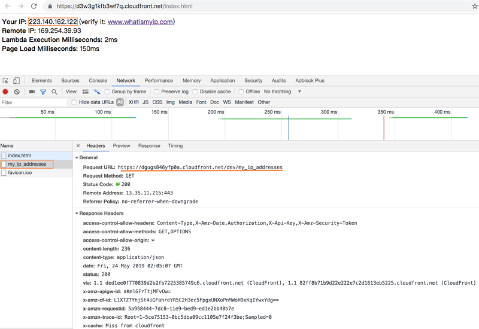
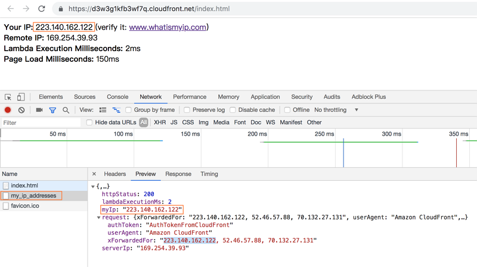
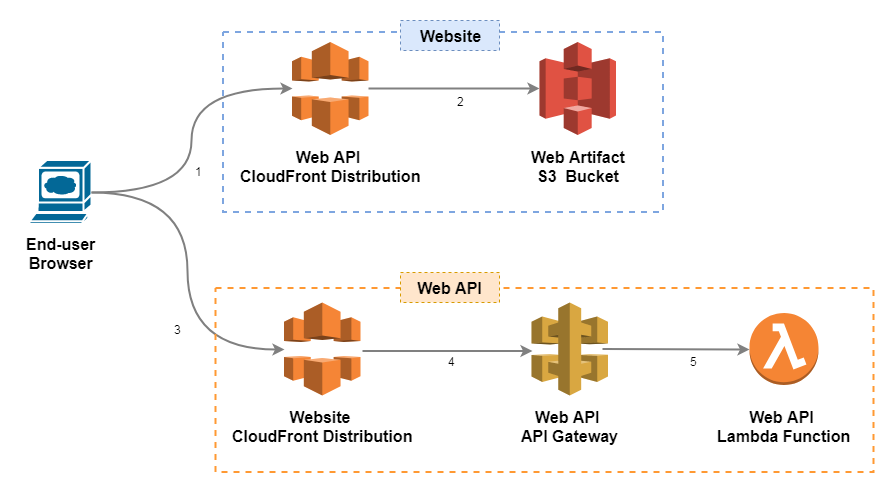

# What is My IP

## User Guide

This service is made by AWS serverless solution to display user's IP address.

- Website URL: https://d3w3g1kfb3wf7q.cloudfront.net/index.html
- Web API URL: https://dgugs846yfp0a.cloudfront.net/dev/my_ip_addresses

### Screenshots





---

## Design Specification



- Web API:
  - CloudFront:
    - provide URL for end-user (proxy pass the request to API Gateway stage URL).
    - redirect HTTP to HTTPs.
    - no cache TTL.
    - pass the 'access_token' to Web API by 'Origin Custom Headers'.
  - API Gateway:
    - integrate CloudFront and Lambda function.
    - edge optimized type.
    - provide 'my_ip_addresses' resource with GET method.
    - enable CORS.
    - use 'Mapping Template' to transform the request and pass to Lambda.
      ```
      {
          "xForwardedFor": "$input.params().header.get('X-Forwarded-For')",
          "userAgent": "$input.params().header.get('User-Agent')",
          "authToken": "$input.params().header.get('myip-authtoken')"
      }
      ```
  - Lambda Function:
    - authorize the 'authToken' from request.
    - fetch the user and server IP addresses from 'xForwardedFor'.
    - response interface
      ```
      {
          "myIp": "${userIp}",
          "serverIp": "${serverIp}",
          "httpStatus": "${status}"
      }
      ```
- Website:
  - CloudFront:
    - provide URL for end-user (proxy pass the request to website S3 bucket).
    - redirect HTTP to HTTPs.
    - enable cache and object compression.
  - S3:
    - contains website artifacts.
    - bucket and object no public.
- Builds Repository
  - S3:
    - contains API and website artifacts.
    - bucket and object no public.

### Get User IP by Request Header

1. Get value of request X-Forwarded-For' header. The header value contains multiple IP addresses.
2. The web API endpoint type is 'Edge optimized'. So the header value must contains 3 IP addresses at least.
3. Split the header value by comma and get the 'third from last' IP address as the user IP.

### Force S3 Request Website via CloudFront Only

1. Set website S3 bucket and object to 'no public'.
2. Creating a CloudFront 'Origin Access Identity' and adding it to its distribution.
3. Granting the 'Origin Access Identity' permission to read files in the S3 bucket.
   > Reference: [Restricting Access to Amazon S3 Content by Using an Origin Access Identity](https://docs.aws.amazon.com/en_us/AmazonCloudFront/latest/DeveloperGuide/private-content-restricting-access-to-s3.html)

### Authorize Web API Requests

This is a public website so using the most efficient cost/performance solutions.

1. CloudFront passes a 'authToken' by Origin Custom Headers (header name: myip-authtoken).
2. Lambda function authorizes the authToken. If this authToken is not valid, the Lambda function returns 403 statusCode.
3. The valid header value is only configured in CloudFront and Lambda function.

---

## Codes and Build

Please refer [/code/README.html](code/README.html) for codes, unit tests and build.

---

## Test Report

Please refer [/test/test_report.pdf](test/test_report.pdf) for functional and performance test cases and results.

---

## Deployment Procedures

### Environment Setup

1. Create the Lambda artifact S3 bucket and upload Lambda build

   - Use the [/aws_cloudfront/01.my_ip-code_bucket.yaml](aws_cloudfront/01.my_ip-code_bucket.yaml) to create a CloudFormation stack.
   - Upload the Lambda build to this bucket.

2. Create Web API and Lambda function

   - Use the [/aws_cloudfront/02.my_ip-api.yaml](aws_cloudfront/02.my_ip-api.yaml) script to create a CloudFormation stack.

3. Setup CloudFront for web API

   - Open the [/aws_cloudfront/03.my_ip-api_cloudfront.yaml](aws_cloudfront/03.my_ip-api_cloudfront.yaml) script and modify the 'apiDomainName' parameter by API stage domain name.
   - Use the [/aws_cloudfront/03.my_ip-api_cloudfront.yaml](aws_cloudfront/03.my_ip-api_cloudfront.yaml) script to create a CloudFormation stack.

4. Create website S3 bucket with CloudFront and upload website artifacts

   - Use the [/aws_cloudfront/04.my_ip-view_cloudfront.yaml](aws_cloudfront/04.my_ip-view_cloudfront.yaml) script to create a CloudFormation stack.
   - Upload website artifacts to the S3 bucket.
     > If CloudFront Distribution URL redirects to S3, it means the distribution is enabling. Even if the distribution status is ENABLED. things might take several hours to get themselves right.

### Deployment for New Feature and Change

- Deploy Web API
  - Upload the Lambda build to Lambda S3 bucket.
  - Update the Lambda function by the S3 link.
- Deploy Website
  - Upload the new website artifacts to website S3 bucket.
  - Create a CloundFront 'invalidation' to update CloudFront edge caches.
